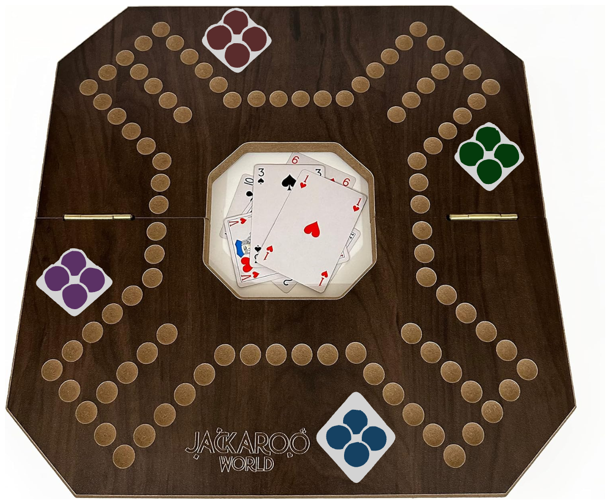

# jackbot

Jackbot is a Jackaroo bot trained with self-play reinforcement learning. The
repo is split into a Rust game engine and a Python/PyTorch training stack.

The current priority is correctness first: nail the rules, legal actions, and
observations in Rust before asking a neural net to learn from them. Training on
bad rules would just produce a very confident idiot.

## Quick Start

Set up the pinned Python 3.12 environment and rebuild the local Rust extension:

```bash
./scripts/bootstrap.sh
```

Run all checks:

```bash
./scripts/verify.sh
```

Run a tiny end-to-end trainer smoke test:

```bash
uv run jackbot-train --smoke
```

Run a short local training job with W&B disabled:

```bash
uv run jackbot-train --updates 10 --num-envs 64 --rollout-len 16 --no-wandb
```

Run the serious league-training job:

```bash
./scripts/train_god.sh
```

On the dedicated Mac, keep the machine awake:

```bash
caffeinate -dimsu ./scripts/train_god.sh
```

Resume after a crash or reboot:

```bash
./scripts/resume.sh
```

Evaluate the best checkpoint:

```bash
uv run jackbot-eval
```

Run the side-swapped gauntlet evaluator:

```bash
uv run jackbot-gauntlet
```

Rank the current legal moves with rollout search:

```bash
uv run jackbot-search --seed 1 --rollouts 64
```

Run the guided real-game advisor:

```bash
uv run jackbot-advisor
```

Play against a checkpoint:

```bash
uv run jackbot-play
```

By default, you are P2+P4 and the model is P1+P3. Add `--human-team even` if
you want to swap sides.

## Engine

The engine crate lives in `crates/jackbot-engine` and owns:

- deterministic seeded games
- card, deck, deal, board, and marble state
- configurable V1 rule knobs
- dynamic legal actions
- legal player observations with hidden hands and deck order excluded
- replay by seed plus action IDs

Run engine tests directly:

```bash
cargo test
```

Play a generated engine game in the terminal:

```bash
cargo run -p jackbot-engine --example play -- --seed 1
```

It prints the current player's hand, board state, and numbered legal moves. Type
the move number to apply it, `h` for help, or `q` to quit.

Run the advisor-shaped smoke test with a random policy:

```bash
cargo run -p jackbot-engine --example random_advisor -- --seed 1
```

This picks one random legal move for every player. Press Enter to apply the
suggestion on the engine and mirror it on a physical board. Type `l` to show
the full legal move list.

Terminal marble labels are sorted by each player's progress toward home:
`#1` is closest to finished, then `#2`, and so on. The CLI hides stable engine
marble IDs because seeded replays are fast enough when exact state needs
debugging.

## Board



`Board.png` contains embedded Excalidraw metadata. Open it at
https://excalidraw.com to move marbles around and inspect scenarios visually.

## House Rules

- Internal players are `0..3`; user-facing tools should show them as `P1..P4`.
- Player labels follow turn order: `P1 -> P2 -> P3 -> P4 -> P1`.
- For a real game, choose `P1` as you or the starting seat, then label the rest
  in turn order.
- Teams are `P1 + P3` vs `P2 + P4`.
- The main track has 76 spaces.
- Absolute board indexes use turn-order positions: `b0` is `P1` spawn, `b19`
  is `P2` spawn, `b38` is `P3` spawn, and `b57` is `P4` spawn.
- Spawn points are 19 spaces apart, meaning 18 spaces between spawn points, not
  counting the spawn spaces themselves.
- Track distance is stored relative to each marble's owner. Distance `0` is
  that player's spawn. Distance `74` is the home-entry square two spaces behind
  spawn; moving forward from there enters home slot `0`.
- Board coordinates are for human display and replay only. Training
  observations intentionally do not include absolute board indexes, so the model
  learns from relative game state instead of the board drawing convention.
- Home has 4 slots. Home movement is forward-only and exact-count.
- A marble on its own spawn is a hard blockade: nobody can pass, kill, or swap
  it. Even the owner cannot use a Jack to swap it off spawn; it can only move by
  legal movement cards such as forward movement or backward 4.
- Burning is forced-only. If any legal play exists, burn actions are not legal.
- Deal cycle is 4 cards, 4 cards, 5 cards, then reshuffle.
- Finished players keep using their own hand, but their own-piece cards control
  their partner's marbles.

## Training

The Python side uses `uv`, PyTorch, PyO3/maturin, and Weights & Biases (`wandb`).
W&B tracks training reward, policy loss, value loss, belief loss, entropy, win
rate by baseline, engine steps/sec, RAM usage, and checkpoint metadata.

The V1 trainer is PPO self-play with a feed-forward MLP. Rust returns legal
observations, dynamic legal actions, both-team rewards, and hidden-hand targets
for the auxiliary belief head. Python never reimplements game rules; it scores
the legal action list Rust gives it.

Default production config:

- `num_envs = 512`
- `rollout_len = 64`
- `total_updates = 1000`
- `hidden_size = 2048`
- model size: `9,369,758` parameters
- checkpoint every 25 updates or 15 minutes
- side-swapped arena eval every 25 updates

Serious long-run profile (`uv run jackbot-train --profile serious` or
`./scripts/train_god.sh`):

- `num_envs = 1024`
- `total_updates = 3000`
- side-swapped arena eval every 50 updates with 256 games
- league training enabled against heuristic, random, self-play, and recent checkpoints

Useful direct commands:

```bash
uv run jackbot-train --smoke
uv run jackbot-train
uv run jackbot-train --profile serious
uv run jackbot-eval
uv run jackbot-gauntlet
uv run jackbot-search --rollouts 64
uv run jackbot-watch --seed 1
uv run jackbot-play
uv run jackbot-advisor
```

Checkpoint tools default to `checkpoints/jackbot_best.pt`, falling back to the
newest nested `jackbot_best.pt` under `checkpoints/`. Pass a checkpoint path
only when you want a specific snapshot.

The "God model" path is not just longer PPO. The repo now supports:

- side-swapped gauntlets against baselines and checkpoints, with 95% confidence
  intervals
- league rollouts where the learner trains against random, heuristic, prior
  checkpoints, and current self-play
- W&B model artifacts for saved checkpoints
- rollout search for move ranking
- JSONL search-target collection plus supervised distillation:

```bash
uv run jackbot-distill collect checkpoints/jackbot_best.pt data/search_targets.jsonl --positions 1024 --rollouts 32
uv run jackbot-distill train data/search_targets.jsonl checkpoints/jackbot_distilled.pt --base-checkpoint checkpoints/jackbot_best.pt --epochs 5
```

Do not resume a checkpoint into a different `hidden_size`; the tensor shapes will
not match. If changing model width, start a fresh run.

For long runs, keep the machine plugged in, awake, and on a hard surface with
real airflow. RL training is sustained CPU load; carpet is not a cooling
strategy, it is a slow-motion hardware crime scene.

## Checkpoints

Training writes:

- `checkpoints/jackbot_latest.pt`: overwritten regularly for crash recovery
- `checkpoints/jackbot_best.pt`: saved when arena score reaches a new high
- `checkpoints/epoch_XXXX.pt`: milestone archives for rollback

Resume the latest checkpoint:

```bash
./scripts/resume.sh
```

Resume a specific checkpoint:

```bash
./scripts/resume.sh checkpoints/epoch_0050.pt
```

## Scripts

The script folder is intentionally small:

- `bootstrap.sh`: rebuild/sync the local Python + Rust extension environment
- `verify.sh`: Rust tests, clippy, and Python tests
- `train_god.sh`: serious long-run training defaults
- `resume.sh`: resume `jackbot_latest.pt` or a specific checkpoint
- `common.sh`: shared environment setup for the other scripts

Everything else should be a direct `uv run jackbot-...` command, not another
one-line shell wrapper.

## Native Builds

The helper scripts source `scripts/common.sh`, which sets
`RUSTFLAGS="-C target-cpu=native"`. That matters for the Rust engine and PyO3
extension. PyTorch is intentionally run on CPU for this project; the ragged
legal-action tensors do not behave well on Apple's MPS backend over long runs.

Run `./scripts/bootstrap.sh` after pulling new code or changing Rust files. It
forces a reinstall of the local `jackbot` package so the compiled extension is
rebuilt for the current Mac.

## Real-Game Advisor

`jackbot-advisor` is the practical hidden-info table workflow. It asks for your
seat and hand, prompts for each revealed card and visible move, auto-saves to
`.jackbot-advisor.json`, and recommends moves from sampled hidden states:

```bash
uv run jackbot-advisor --samples 16 --rollouts-per-sample 2
```

The advisor never asks for opponent hands. It tracks visible cards, hand sizes,
discarded cards, and board state, then samples unknown hands/deck during rollout
search. Move input uses stable marble labels like `P1m1`, `P2m4`, etc.; command
prompts accept `undo` and `q`.
